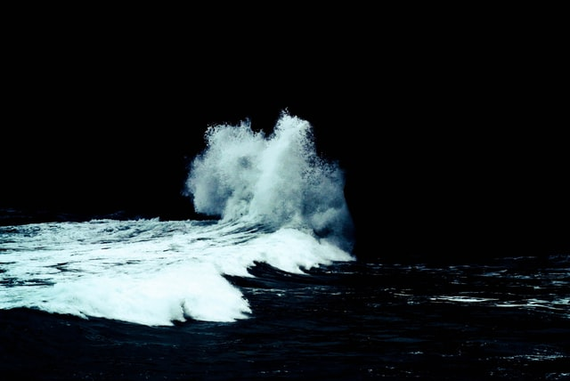

# Začátek

Rozbouřené moře tě jako hadrovou panenku vyvrhlo na kamenitý břeh. Skalnaté pobřeží bičuje silný vítr a hustý déšť. Opodál ve vlnách se zmítá tvá plachetnice, která se právě rozlomila o skaliska.

Co uděláš?

Vyškrábeš se ven z vody a vydáš se do skal hledat úkryt před deštěm a větrem.

[Úkryt](pevnina/ukryt.md)

Vrhneš se do vln zachránit z lodi aspoň něco, co by ti mohlo pomoct přežít v divočině.

[Plachetnice](more/plachetnice.md)
